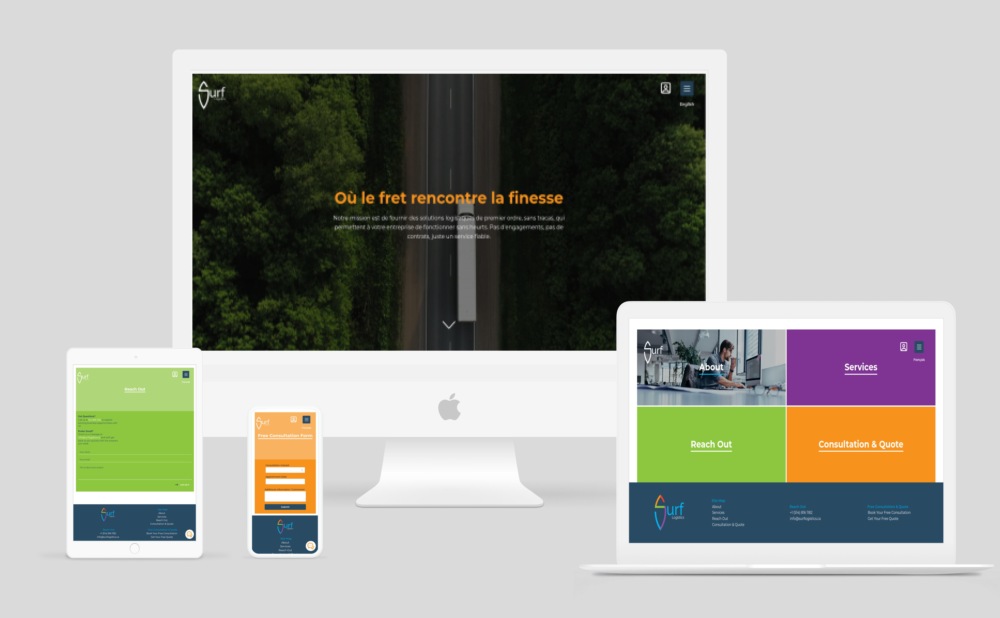

# 📦 Logistics & Shipping Platform (MERN)

A comprehensive web solution for a shipping and logistics company. This project includes a pixel-perfect public-facing website based on a specific design and a robust admin dashboard for managing client interactions.

### 🚀 Key Features

**🌐 Public Website (Client Side)**

* **Multi-Page Layout:** Fully responsive design implementing a professional UI kit.
* **Internationalization (i18n):** Full support for **English** and **French**, allowing users to toggle languages seamlessly.
* **Real-time Support:** Integrated **Tawk.to** widget for live customer messaging and support.
* **Service Showcase:** Detailed pages for shipping services, tracking, and company information.

**🛠 Admin Dashboard**

* **Request Management:** Centralized hub for admins to view and manage consulting and meeting requests submitted by clients.
* **Secure Authentication:** Protected routes for administrative access.

### 🛠️ Tech Stack

* **Frontend:** React.js, Mantine UI (for styling and components)
* **Backend:** Node.js, Express.js
* **Database:** MongoDB
* **Tools:** Tawk.to (Chat), i18next (Localization)


### 🔧 Installation & Setup

 **Clone the repository**
```bash
git clone https://github.com/O2sa/Surf-Logistics-Inc.git

```


#### Run it with docker
##### **Run this command in the root of the project**:
   ```bash
  docker compose up -d
  ```


#### Without docker


1. **Install Dependencies (Root/Backend)**
```bash
cd server
npm install

```


2. **Install Dependencies (Frontend)**
```bash
cd client
npm install

```


3. **Environment Variables**
 - Paste the following content into the `.env` file, replacing the placeholders with your actual values:

    ```
    MONGO_URL=mongodb://localhost:27017/final_surf
    JWT_SECRET=YOUR_JWT_SECRET
    JWT_LIFETIME=30d
    NODE_ENV=production
    PORT=5000
    ```

    
4. **Run the App**
```bash
// run this command in the client and the server
npm run dev

```


